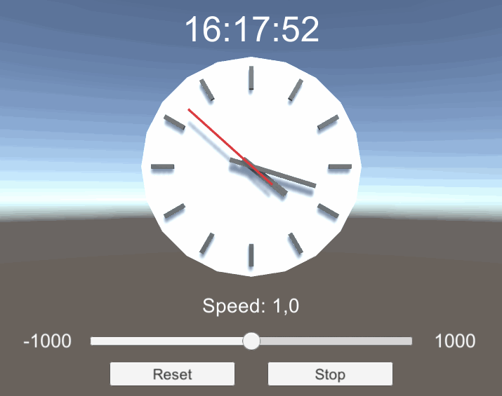

# Clock

Clock with tweakable time speed.
Clock object and arm movement based on [tutorial](https://catlikecoding.com/unity/tutorials/basics/game-objects-and-scripts/).

## Try it
1. [Download zip](https://github.com/dbpienkowska/clock/raw/master/Game/Clock.zip)
2. Unpack
3. Open `Clock.exe`
4. Press `Escape` key to exit

## Features
- Analog clock
- Digital clock
- Configurable time speed (slider UI)
- Day/night effect (rotation of light)

## Implementation details
- Used Scriptable Object for float changed event
- Written script for float watcher that performs float action on change
 
